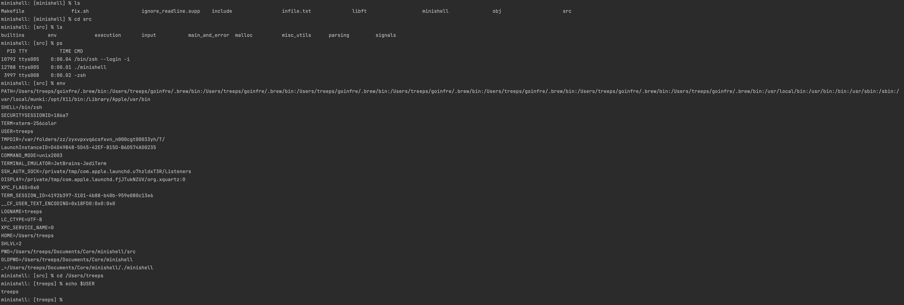

## About me

My name is Thule Reeps, I'm a 21 year old student living in Germany.
I'm studying software engineering at 42 [Wolfsburg](https://42wolfsburg.de), 
an innovative programming school based on peer-to-peer learning as well as project-based learning.

I'm interested in Cybersecurity, Data Science and Game dev.

## Projects

### [fractol](https://github.com/thule-re/fractol-linux)
A fractal renderer written in C, using the minilibx library. 
The program is able to render the Mandelbrot, Julia and Tricorn fractals. 
The user can zoom in and out, change the color palette and move around the fractal.

### [cub3d](https://github.com/thule-re/cub3d)
A raycasting engine written in C, using the minilibx library.
The game is based on the Wolfenstein 3D engine, but is missing some features.
The engine is able to render a 3D maze from a given map file. 
The player can move around the maze.

### [webserv](https://github.com/thule-re/webserv)
A webserver written in C++. 
The server is able to handle GET, POST and DELETE requests, as well as CGI scripts.
The server is able to handle multiple requests at the same time.

### [minishell](https://github.com/thule-re/minishell)
A terminal shell written in C and based on bash.
The shell is able to handle most bash commands, as well as pipes and redirections.

## Skills
### Coding Languages

### Social Skills

### Technologies

### Tools

### Spoken Languages

## Contact

#### [LinkedIn](https://www.linkedin.com/in/thule-reeps/) - [Email](mailto:reeps.thule@gmail.com)

